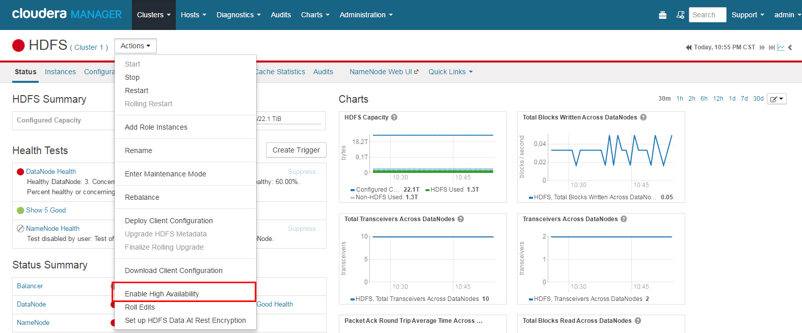
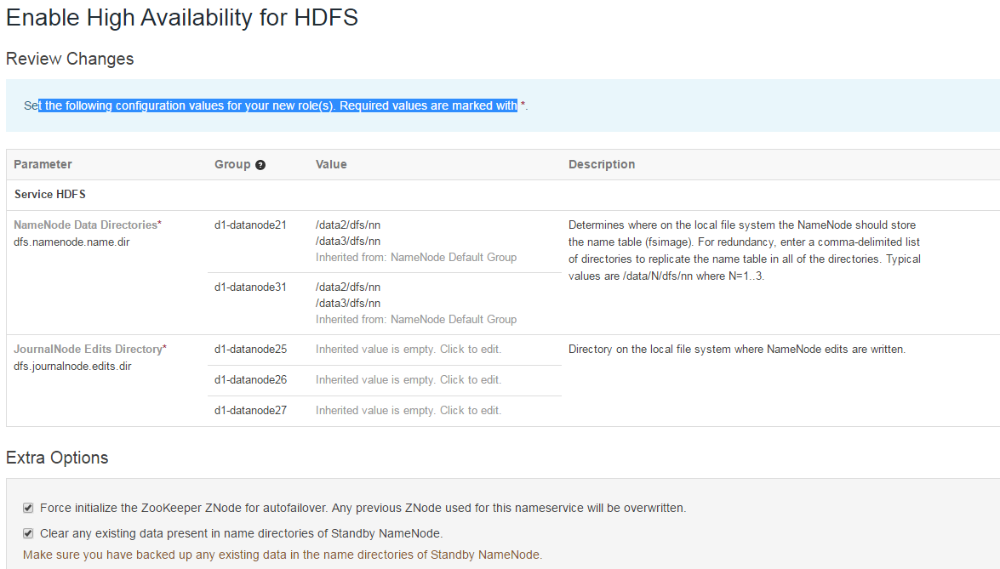
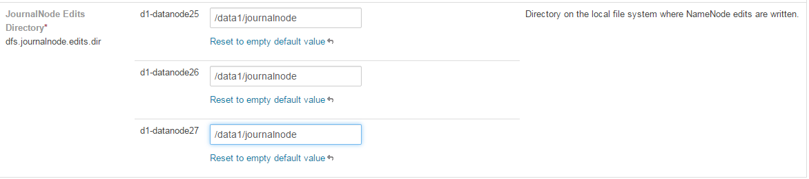
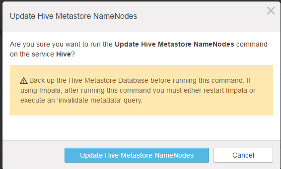
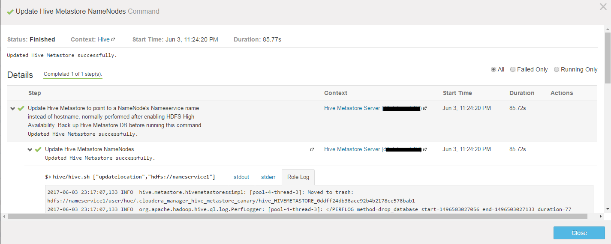

## HDFS High Availability
> 背景：在标准配置中，NameNode是HDFS集群中的单点故障（SPOF）。 每个集群都有一个NameNode，如果该主机或进程变得不可用，则整个集群将不可用，直到NameNode重新启动或在新的主机上运行。 Secondary NameNode不提供故障切换功能。

### 标准方式主要通过两种方式降低HDFS的总可用性：
* 在诸如主机崩溃的计划外事件的情况下，集群不可用，直到操作员重新启动NameNode。
* NameNode机器上的计划维护事件（如软件或硬件升级）导致群集停机时间。

所以HDFS HA可以通过在一个集群中配置两个namenode来解决上述问题。分为活跃的namenode和备用的namenode,在这块可能有人提到secondary namenode也有相同的功能，但是备用namenode与它不同的是，备用NameNode是热备份，允许在主机崩溃的情况下快速自动故障切换到新的NameNode，或者为了进行计划维护而允许管理员启动的优化转换。 
### 实现
> CDH5支持基于Quorum-based Storage的存储作为唯一的HA实现
```
重要提示：在Cloudera Manager 5中，当您尝试使用NFS挂载的共享编辑目录升级为HA配置的CDH 4群集时：
1. 如果在升级之前不禁用HA配置，您的HA配置将继续工作; 但是您会看到一个警告，建议您切换到基于Quorum的存储。
2. 如果在升级之前禁用了HA配置，则无法使用NFS挂载的共享目录重新启用HA。 而是必须将HA配置为使用基于Quorum的存储
```
__重要提示__:需要具体了解如何自动故障切换可以访问以下地址：`https://www.cloudera.com/documentation/enterprise/5-5-x/topics/cdh_hag_hdfs_ha_intro.html`

Disabling and Redeploying HDFS HA Using Cloudera Manager
Minimum Required Role: Cluster Administrator (also provided by Full Administrator)

* Go to the HDFS service.
* Select `Actions` > `Disable High Availability`.
* Select the hosts for the NameNode and the SecondaryNameNode and click `Continue`.
* Select the HDFS checkpoint directory and click Continue.
* Confirm that you want to take this action.
* `Update the Hive Metastore NameNode`.
Cloudera Manager ensures that one NameNode is active, and saves the namespace. Then it stops the standby NameNode, creates a SecondaryNameNode, removes the standby NameNode role, and restarts all the HDFS services.
————————————————————————————————————————————————————————————————————————————————————————————
## 1.配置HDFS的高可用性


我们建议将JournalNodes托管在名称节点类似的硬件规格的机器上。 NameNodes和ResourceManager的主机通常是很好的选择。 您必须至少有三个和奇数的JournalNodes。



这个就保持默认，然后继续时出现问题


返回，写个值


完成此向导后必须执行以下手动步骤：
将HFS服务的HDFS Web Interface角色配置为HFS作为HTTPFS角色而不是NameNode。文档
对于每个Hive服务Hive，停止Hive服务，将Hive Metastore数据库备份到持久存储，运行服务命令“Update Hive Metastore NameNodes”，然后重新启动Hive服务。
————————————————————————————————————————————————————————————————————————————————————————————
## 2.配置CDH其他组件使用HDFS高可用性

配置Hive Metastore、Hue、Impala等CDH组件使用HDFS 高可用性。

### 2.1 配置Hive Metastore使用HDFS高可用性

1. 在Cloudera Manager中，进入Hive Service

2. 点击Actions > Stop，如果Hue和Impala服务正在运行，需要先将其停止
3. 当Hive服务停止以后，请先备份Hive Metastore的数据，即将元数据从MySQL（PostgreSQL或Oracle）库中导出到一个安全目录

4. 选择 Actions > Update Hive Metastore NameNodes并点击Confirm按钮确认。如下图所示


5. 点击Actions > Start，如果Hue和Impala服务已停止，需要先将其启动
————————————————————————————————————————————————————————————————————————————————————————————
## 3.配置Hue使用HDFS高可用性
1. 在Cloudera Manager中，进入HDFS Service
2. 进入Instances标签页面，点击Add Role Instances按钮
3. 点击HttpFS角色下面文本框选择主机，并点击OK按钮
4. 点击Continue按钮
5. 返回Instances页面，选择HttpFS角色，并点击Start启动服务
6. HttpFS服务启动后，点击进入Hue Service > Configuration页面
7. 找到Service-Wide > HDFS Web Interface Role属性，选中httpfs单选框
8. 点击Save Changes按钮保存修改并重启Hue服务
————————————————————————————————————————————————————————————————————————————————————————————


### 介绍一下几个role的作用：
* JournalNode

1. 两个NameNode为了数据同步，会通过一组称作JournalNodes的独立进程进行相互通信。当active状态的NameNode的命名空间有任何修改时，会告知大部分的JournalNodes进程。standby状态的NameNode有能力读取JNs中的变更信息，并且一直监控edit log的变化，把变化应用于自己的命名空间。standby可以确保在集群出错时，命名空间状态已经完全同步了。
2. 集群启动时，可以同时启动2个NameNode。这些NameNode只有一个是active的，另一个属于standby状态。active状态意味着提供服务，standby状态意味着处于休眠状态，只进行数据同步，时刻准备着提供服务。如下所示：

```
对于HA集群而言，确保同一时刻只有一个NameNode处于active状态是至关重要的。否则，两个NameNode的数据状态就会产生分歧，可能丢失数据，或者产生错误的结果。为了保证这点，JNs必须确保同一时刻只有一个NameNode可以向自己写数据
```
3. 硬件资源：
为了部署HA集群，应该准备以下事情：

* NameNode服务器：运行NameNode的服务器应该有相同的硬件配置。

* JournalNode服务器：运行的JournalNode进程非常轻量，可以部署在其他的服务器上。注意：必须允许至少3个节点。当然可以运行更多，但是必须是奇数个，如3、5、7、9个等等。当运行N个节点时，系统可以容忍至少(N-1)/2(N至少为3)个节点失败而不影响正常运行。 

在HA集群中，standby状态的NameNode可以完成checkpoint操作，因此没必要配置Secondary NameNode、CheckpointNode、BackupNode。如果真的配置了，还会报错。