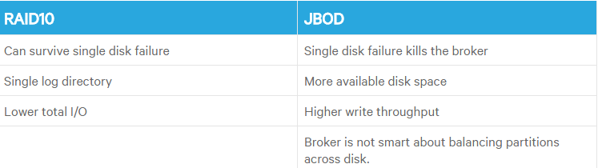

## kafka安装
### kafka安装
* 这步很简单，先是在parcels下载本地源，然后下载，分发，安装并激活一系列手动页面操作。

* 然后添加服务

等等按顺序操作。即可安装成功：

CDH kafka安装很简单也很方便，所以就大概说下
### kafka需要注意：（暂时没有使用配置）
* kafka broker的平稳关闭
如果kafka broker没有正常关闭，则后续的重启可能需要比预期更多的时间。当broker花费超过30秒钟的时间，在停止Kafka服务，停止Kafka broker角色或停止运行Kafka服务的集群时，可能会发生这种情况。 kafka broker也被关闭，作为升级的一部分。 您可以设置两个配置属性来控制Cloudera Manager是否等待broker平稳地关闭：
* Kafka Shutdown配置

具体配置：
1. Clusters > Kafka Service > Configuration and search for "shutdown"

如果Kafka需要很长时间才能完成控制关机，可以考虑增加平滑关机超时值。 一旦达到此超时，Cloudera Manager会发出强制关机，这将中断受控关机，并可能导致后续重新启动的时间超过预期。

### Disks and Filesystem
* Cloudera建议您使用多个驱动器以获得良好的吞吐量。为了确保良好的延迟，请不要与应用程序日志或其他OS文件系统活动共享用于Kafka数据的相同驱动器。您可以使用RAID将这些驱动器组合到单个卷中，也可以将每个驱动器格式化并挂载为其自己的目录。由于Kafka具有复制功能，所以RAID也可以在应用层提供冗余。这个选择有几个权衡。
* 如果配置了多个数据目录，则会将分区分配给数据目录。每个分区完全存储在其中一个数据目录中。如果分区之间的数据数据并不平衡，这可能导致磁盘之间的负载不平衡。
* RAID可以更好地平衡磁盘之间的负载，因为它将负载平衡在较低的级别。 RAID的主要缺点是写入吞吐量通常是一个很大的性能，它减少了可用的磁盘空间。
* RAID的另一个潜在好处是可以容忍磁盘故障。然而，重建RAID阵列是如此I/O密集型，可以有效地禁用服务器，因此这不会提供更多的可用性。

__下表总结了RAID10与JBOD的优缺点__:
