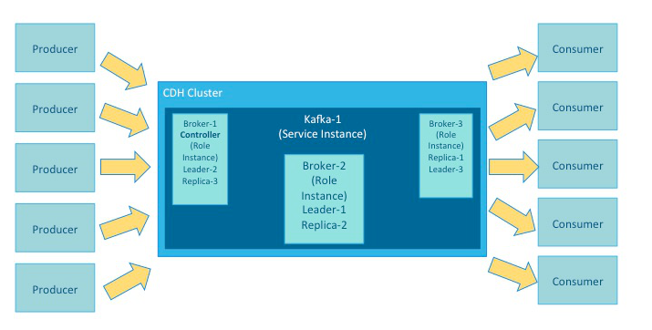

## 谈谈kafka
### 总览
> Cloudera分发Apache Kafka是一种分布式提交日志服务。 kafka功能非常像发布/订阅消息传递系统，但具有更好的吞吐量，内置的分区，复制和容错能力。 kafka是大规模消息处理应用的理想解决方案。 它经常与Apache Hadoop，Apache Storm和Spark Streaming一起使用。

kafka可以提供的是：

* 使用O(1)磁盘结构进行持久消息传递，这意味着Kafka算法的执行时间与输入的大小无关。 执行时间是恒定的，即使有太字节的存储消息。
* 高吞吐量，每秒支持数十万条消息，即使是适度的硬件。
* 明确支持通过Kafka服务器分区消息。 它在维护消息流的顺序的同时在消费者机器群集上分配消费。
* 支持并行数据加载到Hadoop中。

### 说一下kafka中的专业术语:

* 服务是在CDH群集中运行的应用程序。 kafka是一种服务。 ZooKeeper是一个在Kafka群集中运行的服务。 其他服务包括MapReduce，HDFS，YARN，Flume和Spark。角色是服务的一个特征。 broker在kafka服务中扮演角色。

* kafka broker流程记录组成topic,topic是一类具有相同特征的的记录。生产者是一个外部程序发送记录到kafka topic,消费者是从Kafka群集接收主题流的外部进程。

* broker在partitions中处理topic。 集群中一个broker上的partition是leader。 相同的partition在集群中的一个或多个其他broker作为副本进行镜像。 当leader off-line时，replica副本自动占据其位置，成为该topic的新leader。 in-sync replica(t同步副本)是与leader完全更新的副本。

* 每一个kafka集群中有一个broker扮演的是controller,controller负责管理partition和replicas(副本)的状态。它还执行管理任务，如重新分配分区。
