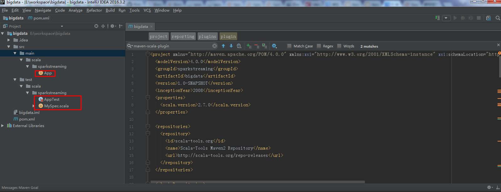
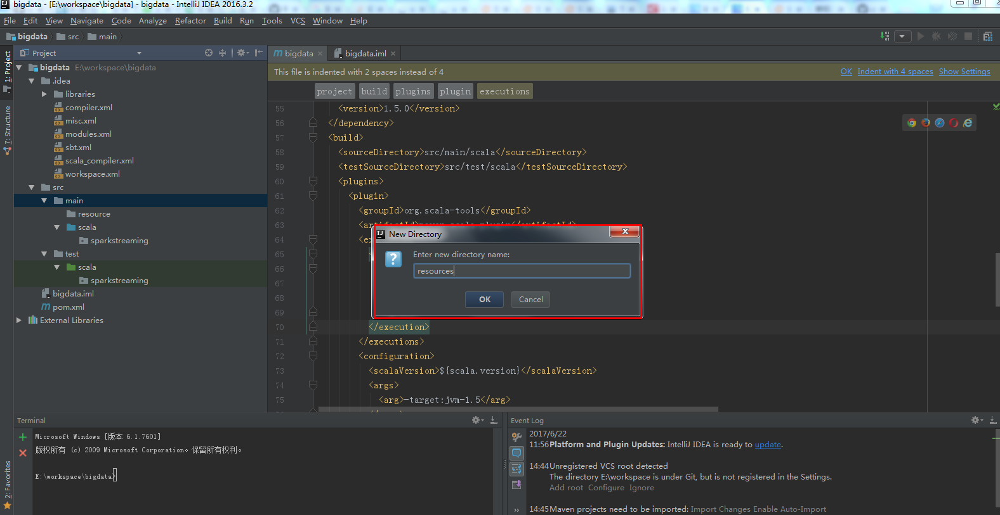
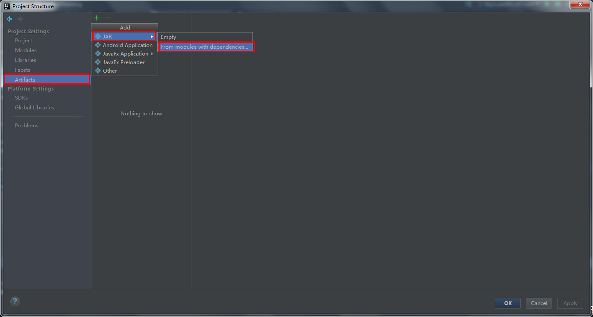

## 基于Intellij IDEA搭建Spark开发环境
> 主要介绍基于Intellij IDEA搭建Spark开发环境
## 用maven构建scala项目


继续下一步

完成finish.IDEA会自动下载所要依赖的包以及pom等。这样做不会产生版本冲突等

由于我本地的scala版本是：2.10.4

选中delete,就可以

然后进行修改配置文件
pom.xml引入依赖(spark依赖、打包插件等等)

```
<project xmlns="http://maven.apache.org/POM/4.0.0" xmlns:xsi="http://www.w3.org/2001/XMLSchema-instance" xsi:schemaLocation="http://maven.apache.org/POM/4.0.0 http://maven.apache.org/maven-v4_0_0.xsd">
  <modelVersion>4.0.0</modelVersion>
  <groupId>sparkstreaming</groupId>
  <artifactId>bigdata</artifactId>
  <version>1.0-SNAPSHOT</version>
  <inceptionYear>2008</inceptionYear>
  <properties>
    <scala.version>2.10.4</scala.version>
    <spark.version>1.5.0</spark.version>
  </properties>

  <repositories>
    <repository>
      <id>scala-tools.org</id>
      <name>Scala-Tools Maven2 Repository</name>
      <url>http://scala-tools.org/repo-releases</url>
    </repository>
  </repositories>

  <pluginRepositories>
    <pluginRepository>
      <id>scala-tools.org</id>
      <name>Scala-Tools Maven2 Repository</name>
      <url>http://scala-tools.org/repo-releases</url>
    </pluginRepository>
  </pluginRepositories>

  <dependencies>
    <dependency>
      <groupId>org.scala-lang</groupId>
      <artifactId>scala-library</artifactId>
      <version>${scala.version}</version>
    </dependency>
    <dependency>
      <groupId>junit</groupId>
      <artifactId>junit</artifactId>
      <version>4.4</version>
      <scope>test</scope>
    </dependency>
    <dependency>
      <groupId>org.specs</groupId>
      <artifactId>specs</artifactId>
      <version>1.2.5</version>
      <scope>test</scope>
    </dependency>
  </dependencies>

  <build>
    <sourceDirectory>src/main/scala</sourceDirectory>
    <testSourceDirectory>src/test/scala</testSourceDirectory>
    <plugins>
      <plugin>
        <groupId>org.scala-tools</groupId>
        <artifactId>maven-scala-plugin</artifactId>
        <executions>
          <execution>
            <goals>
              <goal>compile</goal>
              <goal>testCompile</goal>
            </goals>
          </execution>
        </executions>
        <configuration>
          <scalaVersion>${scala.version}</scalaVersion>
          <args>
            <arg>-target:jvm-1.5</arg>
          </args>
        </configuration>
      </plugin>
      <plugin>
        <groupId>org.apache.maven.plugins</groupId>
        <artifactId>maven-eclipse-plugin</artifactId>
        <configuration>
          <downloadSources>true</downloadSources>
          <buildcommands>
            <buildcommand>ch.epfl.lamp.sdt.core.scalabuilder</buildcommand>
          </buildcommands>
          <additionalProjectnatures>
            <projectnature>ch.epfl.lamp.sdt.core.scalanature</projectnature>
          </additionalProjectnatures>
          <classpathContainers>
            <classpathContainer>org.eclipse.jdt.launching.JRE_CONTAINER</classpathContainer>
            <classpathContainer>ch.epfl.lamp.sdt.launching.SCALA_CONTAINER</classpathContainer>
          </classpathContainers>
        </configuration>
      </plugin>
    </plugins>
  </build>
  <reporting>
    <plugins>
      <plugin>
        <groupId>org.scala-tools</groupId>
        <artifactId>maven-scala-plugin</artifactId>
        <configuration>
          <scalaVersion>${scala.version}</scalaVersion>
        </configuration>
      </plugin>
    </plugins>
  </reporting>
</project>

```
* maven依赖关系
> Similar to Spark, Spark Streaming is available through Maven Central. To write your own Spark Streaming program, you will have to add the following dependency to your SBT or Maven project.

[](http://spark.apache.org/docs/1.5.0/streaming-programming-guide.html#linking)
```
<dependency>
    <groupId>org.apache.spark</groupId>
    <artifactId>spark-streaming_2.10</artifactId>
    <version>1.5.0</version>
</dependency>
```
* 为了养成好的开发习惯

Mark directory之后才可以生效


## 建立第一个MyScalaWordCount.scala
```
package sparkstreaming

import org.apache.spark.{SparkConf, SparkContext}

/**
  * Created by wangchong on 2017/6/22.
  */
object MyScalaWordCount {
  def main(args: Array[String]): Unit = {
    //参数检查
    if (args.length < 2) {
      System.err.println("Usage: MyScalaWordCout <input> <output> ")
      System.exit(1)
    }
    //获取参数
    val input = args(0)
    val output = args(1)
    //创建scala版本的SparkContext
    val conf = new SparkConf().setAppName("MyScalaWordCout ")
    val sc = new SparkContext(conf)
    //读取数据
    val lines = sc.textFile(input)
    //进行相关计算
    val resultRdd = lines.flatMap(_.split(" ")).map((_, 1)).reduceByKey(_ + _)
    //保存结果
    resultRdd.saveAsTextFile(output)
    sc.stop()
  }
}
```

## 打成jar包，然后上传到服务器中运行第一个spark程序
* 使用maven打包（强烈推荐，快捷又迅速）

```
mvn clean package

mvn package
```
* Artifacts方式进行打成jar包
File --> Project Structure


因为每台机器都安装spark,scala，所以可以将与scala,spark相关的jar包删除掉

然后OK
Build --> Build Artifacts --> Build

所以会在out目录下看到该jar包