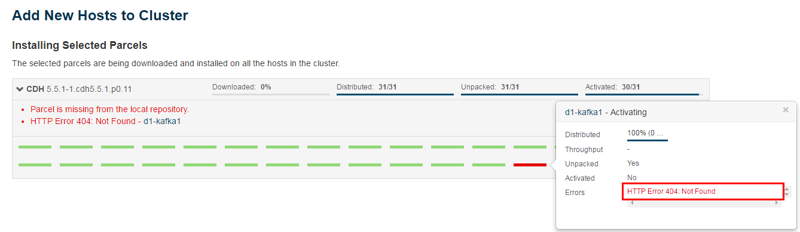

## CDH安装过程中异常处理
### 1. Installing Selected Parcels（HTTP Error 404 Not Found）

###＃解决办法有两种：
本地包源库路径Local Parcel Repository Path：/opt/cloudera/parcel-repo

*  直接下载
  http://archive.cloudera.com/cdh5/parcels/5.5.1/从该地址下载到上述路径
*  从集群中其他机器进行拷贝
  scp /opt/cloudera/parcel-cache/* root@hostname:/opt/cloudera/parcel-cache/

然后集群检测到该路径下有该包之后就可以通过了。
