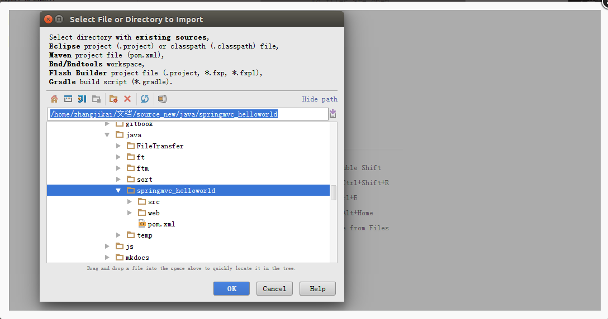
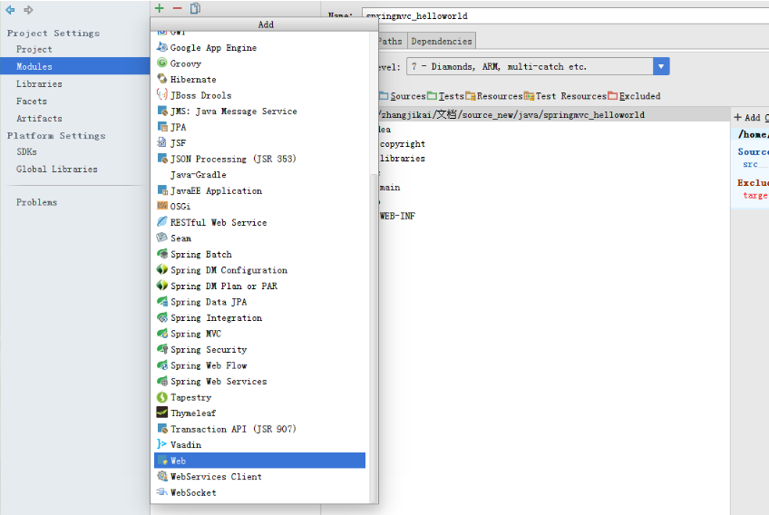
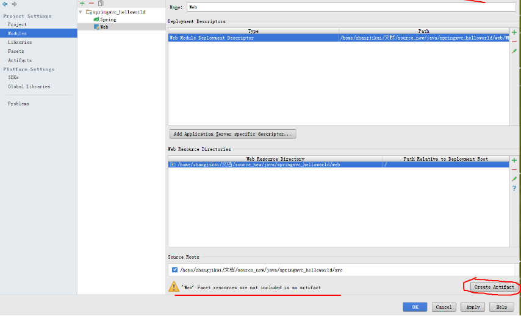
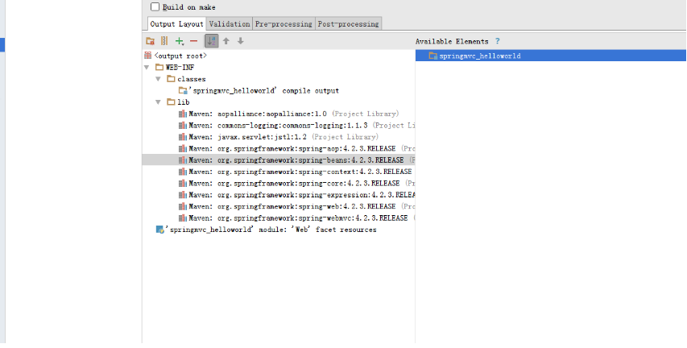

## Intellij IDEA 导入maven web项目
> Intellij IDEA 导入maven web项目并部署到Tomcat
## 前言
本文中所使用的IDEA版本为14.1.1, 所使用测试项目为sping mvc的一个最简单的示例, 可以在这里下载示例代码
## 导入项目
* File -> New -> Project from Existing Source

* 选择maven项目所在的文件夹

* Import project from external model -> Maven

* 使用默认设置, 然后一直Next, 直到项目创建成功.

## 配置项目

* 我们打开applicationContext.xml 会提示 Create Spring facet, 我们点击它, 增加对Spring 的支持

* 点击右侧的+ 号选择Spring 的配置文件

## 添加Web支持
* File -> Project Structure… -> Modules -> 选中项目(不是Spring) , 然后点击上方的+号

* 选择 Web

* 然后我们会看到在下方会提示'Web' Facet resources are not included in an artifact, 我们点击Create Artifact新建一个

* 然后我们会跳转到Artifacts选项中, 注意右侧Available Elements , 这些是Spring的依赖包, 我们在这些依赖包上双击, 就可以添加到WEB-INF的lib文件夹中, 这样部署到Tomcat上程序才可以正常运行.

* 下图是点击之后的效果, 然后点击OK即可

http://blog.zhangjikai.com/2015/12/26/%E3%80%90%E8%BD%AF%E4%BB%B6%E3%80%91Intellij-IDEA-14-%E5%AF%BC%E5%85%A5maven-web%E9%A1%B9%E7%9B%AE%E5%B9%B6%E5%8F%91%E5%B8%83%E5%88%B0Tomcat/