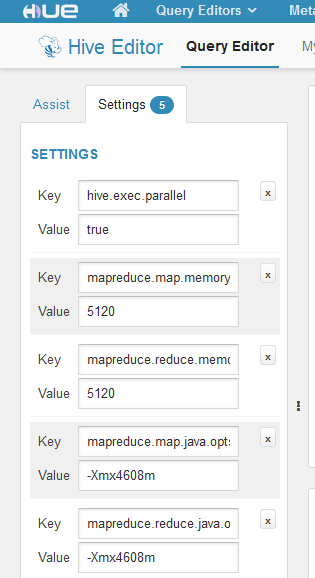

## 1. 跑HUE时候由于数据量过大会报java堆空间不够用

__现象__：需要跑年累计或者count(distinct vid) UV where dt >= '2016-01-01' and dt < '2017-01-01'
这样的近一年的近两年的！数据量太大会报错！java堆空间不够用的错误！被分配到的那台机器空间刚好也不够


__解决办法__：
* 在hue上加参数运行！

* 或者在hive命令行增大参数进行运行：

hive上进行配置参数进行跑数
```
mapreduce.map.memory.mb=5120 
mapreduce.reduce.memory.mb=5120 
mapreduce.map.java.opts=-Xmx4608m
mapreduce.reduce.java.opts=-Xmx4608m
```
这几个参数主要是针对这些数据量特别大的（近一两年的）使用！