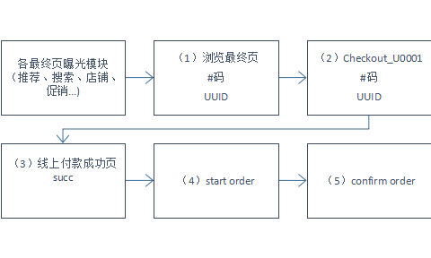
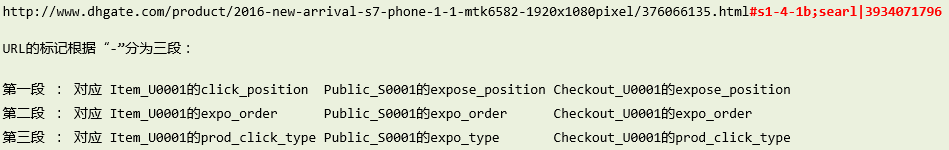

### 最终页模块逻辑

#### 一、 一般曝光模块
路径：
（1）-（4）-（5）

* 语言&站点：
要求最终页的语言和站点与下单时的语言和站点一样

* 时间性：
  * 要求在最终页的当天完成下单；
  * 下单时间在最终页时间之后；
  * 订单在下单的当天或者第二天完成confirm；

* 其它通用限制条件：
vid不为空

* 关联条件：
vid 或者 buyerid    item_code

#### 二、特殊曝光模块说明（搜索+推荐）

* 搜索（click_position rlike '^s[0-9]+'）
* 路径：
（1）-（4）-（5）
搜索www需要有一个特殊处理，就是列表页加入购物车情况
（2）-（4）-（5）

* 语言&站点&时间性：
同上

* 其它通用限制条件：
同上+UUID不为空

* 关联条件：
同上+UUID

* 推荐
路径：
后端曝光-（1）-（4）-（5）
后端曝光见下面说明d)；历史推荐不能限制UUID和后端曝光，只能通过#tracking来限定（1）-（4）-（5）
其余限制同搜索

#### 三、一些表和数据说明
a)最终页#tracking的第一段在click_position字段，具体参考下面的整理
