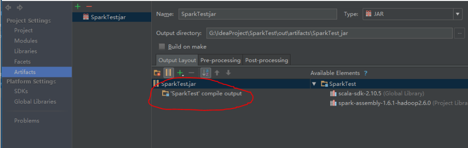
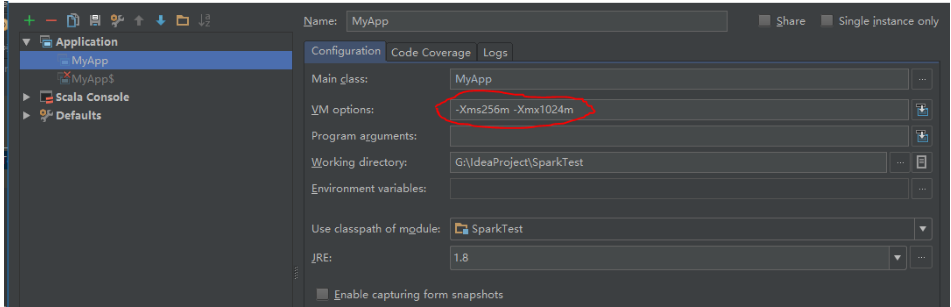

## build Artifacts时报错outofmemoryerror
> 主要介绍build Artifacts时报错outofmemoryerror
## 现象1：build Artifacts时报错Java.lang.outofmemoryerror

配置时output，因为运行环境中已经有相关包，所以其他包删除，只保留’compile output’那一项，这时再build就不会内存溢出
## 现象2：run时报错java.lang.outofmemoryerror

在run configuration中的VM options中-Xms256m -Xmx1024m 
这时再build就不会内存溢出
